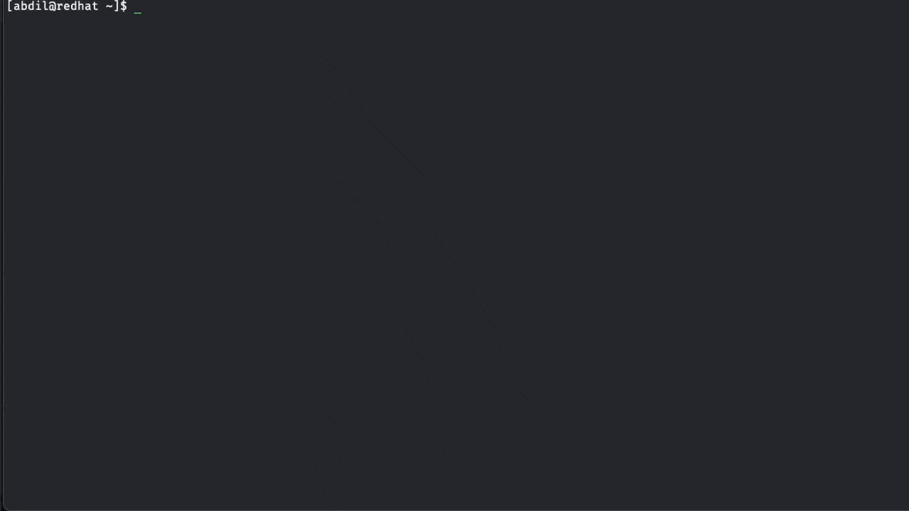
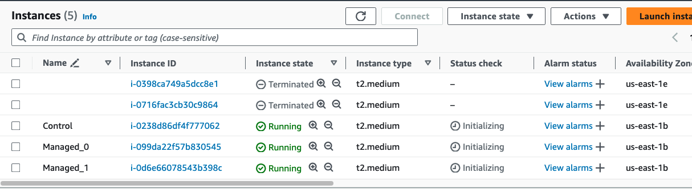
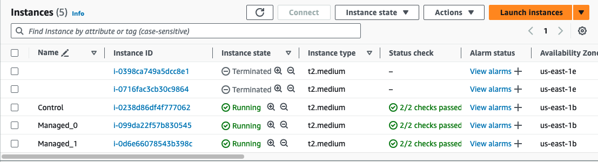
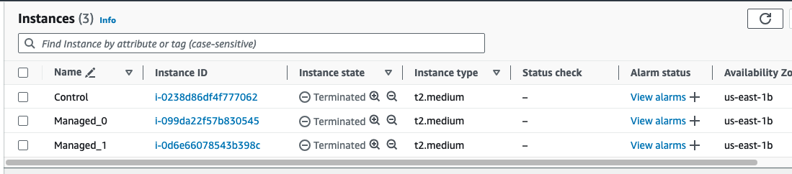

This project aims to use IAC(Infrastructure as code) to provision and manage AWS resources. Some tools that will be used include Terraform, Packer, Ansible, Podman/Docker, Cockpit, etc..
> **Note:** This repo is was set up to run on RedHat/Centos, Ubuntu, and AWS Linux 2 Operating Systems

## Table Of Content
[STEP 1: Get AWS Credentials](#step-1-get-aws-credentials)<br>
[STEP 2: Storing credentials](#step-2-storing-credentials)<br>
[STEP 3: Clone Repo + Install Terraform/Packer](#step-3-clone-repo--install-terraformpacker)<br>
[STEP 4: Build Packer images](#step-4-build-packer-images)<br>
[STEP 5: Build AWS Infrastructure with Terraform](#step-5-build-aws-infrastructure-with-terraform)<br>
[STEP 6: Ansible Setup](#step-6-ansible-setup)<br>
[STEP 7: Podman/Docker Setup](#step-7-podmandocker-setup)<br>


## STEP 1: Get AWS Credentials

To access/set up AWS services remotely, we need to have access keys, So IAM(Identity and Access Management) should be set where the user has **AdministratorAccess** in **Permissions Policies.** For security purposes, a new IAM role with only the permissions needed to access resources used in Terraform/Packer should be created, then attach that new role to the user account
> **Note:** New access keys should be generate
> 


### **Method 1:** Using AWS CLI
https://docs.aws.amazon.com/cli/latest/userguide/cli-services-iam-create-creds.html

### **Method 2:** Using AWS Dashboard

1. Login to AWS account, then go to the search bar and type “**IAM**”
2. Then click Users, then choose one of the users under “**User name**”
     > Note: Make sure the user selected has the necessary permissions, so they should have **AdministratorAccess** in **Permissions policies**
     >
 3. Then click “**Create access key**”, then click “**Other**” and then Next
 4. Then click “**Create access key**”
 5. Then click “**Download .csv file**” or copy the “**Access key**” and “**Secret access key**”
    > Note: If you click done without saving the keys, you will need to create new keys
    >
    
    
    
<br>

## STEP 2: Storing credentials

When we run Terraform/Packer, we need to validate our AWS credentials. We could do this in many ways, like using environment variables, but here, we will use an AWS credentials directory.

1. Create an AWS credentials directory in the user's home directory.
        
    ```bash
    [user@local ~]$ mkdir ~/.aws
    ```
        
2. Create 2 files *~/.aws/config* and *~/.aws/credentials*
        
    ```bash
    [user@local ~]$ touch ~/.aws/{config,credentials}
    ```
        
3. Inside the **config** file, we add our default region(which will be **us-east-1**), and the **credentials** file will contain the AWS Credentials(Access key, Secret access key) we saved from **STEP 1**.

    ```bash
    # Config FILE
    [user@local~]$ cat > ~/.aws/config <<EOF
    [default]
    region="us-east-1"
    EOF

    # Credentials FILE
    [user@local~]$ cat > ~/.aws/credentials <<EOF
    [default]
    aws_access_key_id=<ACCESS-KEY>
    aws_secret_access_key=<SECRET-ACCESS-KEY>
    EOF
    ```
<br> 

## STEP 3: Clone Repo + Install Terraform/Packer

- After setting up the Credentials/Config files we can clone the iac-project repo
    
   ```bash
   [user@local ~]$ git clone https://github.com/abdilmajid/iac-project.git
   ```
    
- cd into the **iac-project** directory and execute the **tf-packer-install.sh** script
    
   ```bash
   [user@local ~]$ cd ~/iac-project/
   [user@local iac-project]$ sh ~/iac-project/tf-packer-install.sh
   ```
    
   > **Note:** the script will install Terraform/Packer if packages not already installed, and also create and store ssh-keys inside a folder called “**keys**”
    > 

   
        
<br>

## STEP 4: Build Packer images

- After setting up the AWS credentials and installing Terraform/Packer, we can start building the AMI(Amazon Machine Image) that Terraform will use when setting up the EC2 instance
    
    > **Note:** You can run the "**build-pkr-tf.sh**" script, which builds the Packer images, then copies the AMI names to a file used to set up the AWS infrastructure.
    > 
<br>

- The base image is "**CentOS Stream 9 x86_64**"(https://www.centos.org/download/aws-images/)
- 2 images are created, **control** and **managed**, both images will have a new user added with the name **ansible**, and the **control** image will have the **ansible** package installed.
- both images will also have all necessary permissions and keys setup
1. cd into the images directory, then initialize Packer
    
    ```bash
    [user@local iac-project]$ cd ~/iac-project/images/
    [user@local images]$ packer init .
    ```
    
2. Then cd into “**ami-control**” directory and run the command “**packer build .**”, this command will use packer to build the AMI(amazon managed image) for the control node
    
    ```bash
    [user@local images]$ cd ~/iac-project/images/ami-control/
    [user@local ami-control]$ packer build .
    ```
    
    > **Note:** Check the aws dashboard to see that **ami-control** was built
    > 

<br>

3. Then, cd into the **ami-managed** directory and run the same command, “**packer build .**” this will build the AMI for the managed node
    
    ```bash
    [user@local ami-control]$ cd ~/iac-project/images/ami-managed/
    [user@local ami-managed]$ packer build .
    ```
    
    > **Note:** Open a second terminal and run the command because it could take ~10min for each image to build, so to save time, they should be run concurrently
    > 

<br>

- Once the builds are complete, we should see a message in the terminal containing the new AMI's. These AMI's will also be displayed on the AWS dashboard inside **EC2 > Images > AMIs > Owned by me**

  
        
<br>

## STEP 5: Build AWS Infrastructure with Terraform

- Once we have the two AMI images built with Packer, we need to copy them to the **variables.tf** file inside the Terraform directory.
    
    > **Note:** The AMI’s built with packer should already be copied into the variables.tf file. So just check that the values are correct
    > 
<br>

- cd into the terraform directory
    
    ```bash
    [user@local~]$ cd ~/iac-project/terraform/
    ```
    
- Inside the terraform directory go to the **variables.tf** file, this file is where we store variables we want to use inside our **main.tf** file. The AMI’s created using packer should be stored inside the variables **ami_control** and **ami_managed**

- Now we can build the AWS infrastructure, 
- Inside the terraform directory, run 
    1. terraform init 
    2. terraform validate
    3. terraform plan
    4. terraform apply -auto-approve

    ```bash
    [user@local terraform]$ terraform init
    [user@local terraform]$ terraform validate
    [user@local terraform]$ terraform plan
    [user@local terraform]$ terraform apply -auto-approve
    ```

  
    
<br>

## STEP 6: Ansible Setup

- The AWS Infrastructure should be setup so that 3 EC2 instances are running, one instance will be the control node which is used to manage the other 2 instance(managed nodes)
- Ansible is used inside the control node to manage the 2 instances
    
    
    
    > **Note:** Before running anything we need to make sure that all instances are complete. On the aws dashboard we need to see that “**Status check**” shows “**2/2 checks passed**” for all instances.
    > 
    <br>

    
    
1. cd into ansible directory, 
2. Then run “**ansible_setup.sh**” file
    
    ```bash
    [user@local~]$ cd ~/iac-project/ansible/
    [user@local ansible]$ sh ansible_setup.sh
    ```
    
- The “**ansible_setup.sh**” script will configure all 3 instance so that we can SSH into the control node and manage everything
- Now we can SSH into the control node and test that we can reach our managed nodes
    
    > **Note:** the stdout from running the script should display the public ip address of the control node. This public ip is also available on the aws dashboard or the file created in the terraform directory(~/iac-project/terraform/public_ip)
    > 
   

    ```bash
    [user@local ansible]$ ssh -i ~/iac-project/keys/tf-packer ansible@<IP_CONTROL_NODE>
    [ansible@control~]$ ansible -m ping node0
    [ansible@control~]$ ansible -m ping node1
    ```
    
    
        
<br>

## STEP 7: Podman/Docker Setup

- Inside the control node, we will use the “**ansible-playbook**” command to set up and run the “**faceapp**” application on one managed node and “**storeapp**” on the other.
- run “ansible-playbook ~/playbooks/faceapp.yml” command
    
    ```bash
    [ansible@control~]$ ansible-playbook ~/playbooks/faceapp.yml
    ```
    
    > **Note:** This will create the user “**app**” inside the **node0** managed node and install all packages/repos repos needed, etc…
    > 
  
  

  <br>

- Now we need to SSH into “**node0**” in order to run the podman containers, so we SSH into “**node0”**, then switch to the app user, then cd into the faceapp directory, then we run the “**podman-compose**” command
    
    ```bash
    [ansible@control~]$ ssh node0 
    [ansible@node0~]$ sudo su - app
    [app@node0~]$ cd ~/faceapp/
    [app@node0 faceapp]$ podman-compose up -d --build
    ```
    
    > **Note:** All ssh-keys, config/hosts files, etc.. are set up so we can SSH from the control node to each managed node
    > 
<br>

- The podman-compose command will use “**faceapp.ym**l” build the faceapp application
- When the build is complete we can check to see if containers are running by running “podman-compose ps” command on the terminal, or by using the cockpit wed-interface
    
    ```bash
    [app@node0 faceapp]$ podman-compose ps
    ```
    
    > **Note:** make sure to run commands inside “**faceapp**” folder
    > 
    

     <br>

- The faceapp playbook will install/enable Cockpit with the podman extension. This allows us to more easily monitor podman containers on a web-browser. So on a browser go to “**http://<PUBLIC_IP_NODE0>:9090**”, the user name is “**app**” and password is “**pass**”

  

<br>

- Now we can check to see if faceapp is running, so on the bowser go to “**http://<PUBLIC_IP_NODE0>:3000**”

  

<br>


- To destroy the containers we need to run the command “podman-compose down”, then “podman system prune -all” to remove everything including any attached volumes/networks etc…

  ```bash
  [app@node0 faceapp]$ podman-compose down
  [app@node0 faceapp]$ podman system prune -a
  ```

  

<br>


- To bring down the AWS infrastructure we would exit out of the control/managed nodes, then inside the “**iac-project**” directory we would cd into the terraform directory, then inside the terraform directory we would run the command “terraform down”

  ```bash
  [app@node0 faceapp]$ exit
  [ansible@node0~]$ exit
  [ansible@control~]$ exit
  [user@local ansible]$ cd ~/iac-project/terraform/
  [user@local terraform]$ terraform destroy
  ```

  

<br>

- Inside AWS dashboard check that all instances where destroyed
  
  
